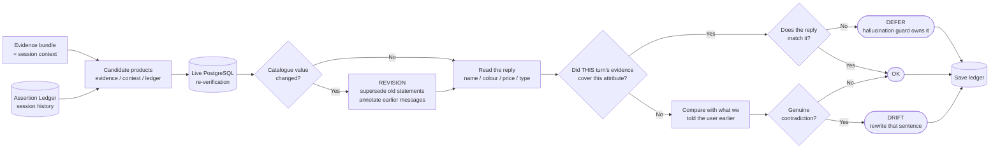
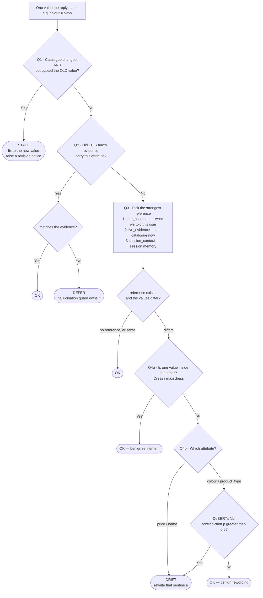
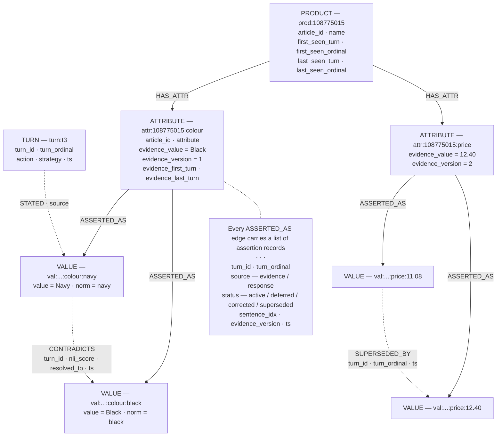
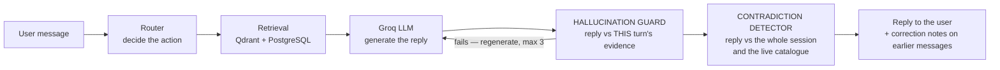

# Cross-Turn Consistency — Full Process

> This document replaces the earlier version, which described a design that did
> not actually perform cross-turn reasoning. Section 2 explains exactly what was
> wrong and how it was proved, because the viva will ask.

---

## 1. What this component is for

The system has **two** safety checks on every response. They sound similar but
ask genuinely different questions.

| Check | Question it asks | Reference it compares against |
|---|---|---|
| **Hallucination Guard** (`text_rag/core/hallucination_checker.py`) | Is this turn faithful to **its own** evidence? | The evidence bundle fetched **this turn** |
| **Cross-Turn Consistency** (`memory/core/contradiction_detector.py`) | Is this turn consistent with what we **already told this user**, and is the catalogue still saying what it said back then? | The **Assertion Ledger** (session history) + the **live database** |

One sentence to remember:

> The guard looks **sideways** at this turn's evidence.
> The ledger looks **backwards** at the whole conversation.

---

## 2. What was wrong before (and how we know)

The old detector did this every turn:

1. Load a session graph from MongoDB
2. **Write** the current turn's evidence into the graph nodes
3. **Read** those same nodes back
4. Compare the response against what it read

Step 2 overwrote every node attribute (`_update_graph_nodes`), and step 3 read
the same attribute back. So the value it compared against was *always* the value
it had just written from **this turn's** evidence.

**Consequences:**

| Problem | Effect |
|---|---|
| The graph was a pass-through | Deleting it would not change a single decision |
| The comparison reduced to `response vs current evidence` | That is the Hallucination Guard's job, done a second time with a second LLM call |
| `if not product_refs: SKIP` | When evidence was empty — cached / follow-up turns — it gave up entirely, which is the one case where history is the *only* possible reference |
| Nodes had no edges | Only `contradiction_event` nodes were attached, and nothing ever read them |

So it detected real errors, but **nothing about it was cross-turn**.

---

## 3. The three failure classes

Once you separate them properly, there are three things that can go wrong. Only
two belong to this component.

### Class 1 — Turn-local unfaithfulness → **not ours**

The response disagrees with **this turn's own** evidence.

```
Evidence this turn : colour = Black
Response says      : "It's Navy"
```

The Hallucination Guard already catches this. We record it as `deferred` and
**never count it** — otherwise one mistake gets reported twice. We also never
let a deferred value anchor a future turn, because it is known-bad.

### Class 2 — Cross-turn drift → **ours**

The response disagrees with what the system said **earlier**, and there is no
database change to justify it.

```
Turn 1  evidence Black   →  bot says "London dress, Black, £11.08"
Turn 4  evidence SILENT (answered from cache)
        bot says "It's Navy"
```

The guard cannot help: there is no evidence this turn to compare against.
The ledger can: it remembers turn 1 said Black.

**Action:** confirm with DeBERTa, rewrite `Navy` → `Black`, log a contradiction.

### Class 3 — Ground-truth revision → **ours, but not an error**

The database value changed between turns.

```
Turn 1  DB says £11.08  →  bot says "£11.08"     ← true at the time
        ... someone updates the catalogue ...
Turn 5  DB says £12.40
```

Turn 1 was **not** a lie. So we do **not** rewrite it. Instead:

- adopt the new value going forward
- mark turn 1's statement `superseded`, not `corrected`
- record which earlier turns quoted the old value
- show a note **under those messages** in the chat

---

## 4. The Assertion Ledger (the graph)

The old graph stored one node per product with overwritable fields. The new one
makes **every distinct value its own node**.

### 4.1 The idea in one analogy — whiteboard vs noticeboard

**Old design = a whiteboard.** Each product had a box labelled "colour". You
write `Black` in it. Later you erase it and write `Navy`. The history is gone,
so you can never ask *"what did I say before?"*

```
product 111
   colour = "Black"     ← turn 4 erases this and writes "Navy"
   price  = "£11.08"       Black no longer exists anywhere
```

**New design = a noticeboard.** "Colour" is a **hook on the wall**. Every colour
ever claimed is pinned to that hook as its own card, and each card records who
claimed it and when. Nothing is erased.

```
product 111
   └── colour  (the hook)
         ├── card: "Black"  — said by the bot on turn 1  — status: active
         └── card: "Navy"   — said by the bot on turn 4  — status: active
```

> **Two active cards on one hook = a contradiction.** That is the whole trick.

### 4.2 Node types — the parts of that noticeboard

| Node | Plain meaning | Example |
|---|---|---|
| `prod:<article_id>` | **the product itself** | the London dress |
| `attr:<article_id>:<attribute>` | **a hook** — one property of that product | "the colour of the London dress" |
| `val:<article_id>:<attribute>:<value>` | **a card on the hook** — one specific answer that property has been given | "Black" |
| `turn:<turn_id>` | **when** something was said | turn 1 of this chat |

The node names are just unique text IDs. `attr:111:colour` is a string meaning
*"the colour-hook belonging to product 111."*

### 4.3 Edge types

| Edge | Meaning |
|---|---|
| `prod → attr` `HAS_ATTR` | this product has this hook |
| `attr → val` `ASSERTED_AS` | this hook holds this card; the edge carries the full history list |
| `turn → val` `STATED` | this turn pinned that card — lets you ask *"what did turn 4 claim?"* |
| `val → val` `CONTRADICTS` | two live response cards on one hook, with no DB change to explain it |
| `val → val` `SUPERSEDED_BY` | the **database** changed. Different from CONTRADICTS: the old card was not wrong, it just aged. This is what stops a price update being reported as a lie. |

### 4.4 Watch the graph get built

**Turn 1 — bot says "London dress, Black, £11.08"**

```
turn:t1
   │ STATED
   ▼
prod:111 ──HAS_ATTR──> attr:111:colour ──ASSERTED_AS──> val:111:colour:black
    │
    └──HAS_ATTR──────> attr:111:price  ──ASSERTED_AS──> val:111:price:£11.08
```

The `ASSERTED_AS` edge is where the detail lives. It holds a **list**:

```
attr:111:colour ──ASSERTED_AS──> val:111:colour:black
   assertions: [
     { turn: t1, source: "evidence", status: "active" }   ← the DB said Black
     { turn: t1, source: "response", status: "active" }   ← the bot said Black
   ]
```

> **Why a list instead of more edges?** A NetworkX `DiGraph` allows only *one*
> edge between the same two nodes. If turn 1 and turn 3 both say "Black", that is
> the same hook→card pair, so we append to the list rather than drawing a second
> edge. It also keeps the graph plainly JSON-serialisable for MongoDB.

**Turn 4 — evidence is silent, bot says "It's Navy"**

A **new card** is pinned to the same hook:

```
                          ┌──ASSERTED_AS──> val:111:colour:black
                          │                    { turn: t1, response, ACTIVE }
attr:111:colour ──────────┤
                          │
                          └──ASSERTED_AS──> val:111:colour:navy
                                               { turn: t4, response, ACTIVE }
```

The hook now has **two active cards**. That is the detection, and in code it is
literally: *walk the outgoing `ASSERTED_AS` edges of `attr:111:colour`; find
response-made assertions still `active` from an earlier turn* → finds `Black`
from turn 1 (`AssertionLedger.prior_assertion`).

**This is impossible on the old whiteboard**, because Black was erased the moment
turn 4's evidence was written.

**Then the correction**

DeBERTa confirms `Black` vs `Navy` is a real conflict (0.999), so:

```
val:111:colour:navy ──CONTRADICTS──> val:111:colour:black
        { turn: t4, nli_score: 0.999, resolved_to: "Black" }

and Navy's card is stamped:  status: active → CORRECTED
```

### 4.5 "Won't cards pile up forever?"

They do accumulate, and the status stamp is what keeps that harmless. After the
turn-4 correction:

```
attr:111:colour
   ├── "Black"  active      ← still stands
   └── "Navy"   corrected   ← kept as an audit record, never used again
```

The Navy card stays on the board **on purpose** — it is the evidence that a
correction happened, and it is what feeds `contradiction_log` and the
*"✓ contradiction corrected"* badge.

**But "active" is not a single slot.** Several assertions can be `active` at the
same moment, in two distinct ways, and both are intended:

```
Same value, several turns          Different values, both benign
attr:111:colour                    attr:111:product_type
   └── "Black"                        ├── "Dress"       active   (turn 1)
        ├── turn_1 active             └── "maxi dress"  active   (turn 3)
        ├── turn_4 active
        └── turn_7 active
```

- **Same value, several turns** — the bot correctly repeated itself. One value
  node, three records on its edge.
- **Different values, both benign** — `Dress` → `maxi dress` passed the
  refinement check, so it was never retired.

**The invariant is compatibility, not uniqueness:**

> Every `active` value in a slot is compatible with every other one. A value
> stays `active` only if, when it was said, it either matched the standing
> statement or was a benign refinement of it. Anything judged a real conflict is
> stamped `corrected`, `deferred` or `superseded` in the same pass — and
> `prior_assertion()` ignores all three.

Two *incompatible* values therefore cannot both be active. Same setup, but turn 3
says `Trousers`:

```
val:Dress      ordinal 1   status=active
val:Trousers   ordinal 2   status=corrected     ← retired the moment drift fired (0.999)
```

What *is* single-valued is the **reading rule**, not the storage:

> `prior_assertion()` returns the `active`, response-sourced record with the
> highest `turn_ordinal` strictly below the current turn.

So "what do we currently stand behind?" always has exactly one answer, however
many cards are pinned up.

**Keeping every active record is load-bearing, not incidental.** When the
catalogue moves, `_supersede()` retires and reports *every* response record of
the old value, not just the newest:

```
turns 1, 4 and 7 all quoted £11.08 → all three are superseded
                                   → all three messages get a correction note
```

Collapse them into one record and two of those messages would silently keep
showing a value the catalogue has abandoned. This is why the same value is
allowed to be active many times over.

### 4.6 Summary of the change

| | Old | New |
|---|---|---|
| A value is | a **field you overwrite** | a **node you add** |
| Detection is | comparing two strings | *"does this disagree with the last thing we stood behind?"* |
| History | destroyed every turn | kept, with status |

That last row is the answer to *"why does this need a graph?"* — the question the
detector asks cannot be answered without stored history.

### 4.7 What each assertion record holds

Every `attr → val` edge carries a list. One entry per time that value was stated:

```json
{
  "turn_id": "turn_abc", "turn_ordinal": 1,
  "source": "response",          // "response" = the bot said it
                                 // "evidence" = the database said it
  "status": "active",            // active | deferred | superseded | corrected
  "sentence_idx": 1,             // which sentence it came from
  "evidence_version": 1          // which DB version it was grounded in
}
```

**Status meanings**

| Status | Meaning | Can it anchor a later turn? |
|---|---|---|
| `active` | Currently stands | ✅ yes |
| `deferred` | Disagreed with its own turn's evidence — guard's problem | ❌ no (known-bad) |
| `superseded` | Was true when said; the catalogue has since moved on | ❌ no (out of date) |
| `corrected` | Was wrong and was rewritten before the user saw it | ❌ no |

---

## 5. What happens on one turn — step by step

```
 1. Load ledger  ─────────────────────────  the session's whole history
 2. Register this turn, get its ordinal     (1st, 2nd, 3rd... turn)
 3. Work out which products are in play
 4. Establish ground truth (live DB read)   ← catches catalogue revisions
 5. Read what the response actually says
 6. Reconcile each statement
 7. Save ledger + write notices
```

### Step 3 — which products are we talking about?

Three sources, in order of trust. The first one to name a product wins.

| Source | When it helps |
|---|---|
| **Evidence bundle** | Normal search turns |
| **`items_in_context`** (session window) | Follow-up turns where evidence is thin |
| **Ledger `known_products()`** | Anything the session has ever discussed |

> This is the fix for the old `SKIP: no product refs` bail-out. A follow-up
> question still refers to real products; we now find them.

### Step 4 — ground truth, read live

Every factual turn re-reads the candidate products straight from PostgreSQL
(one indexed query, max 16 ids).

**Why this is necessary:** cached and PARTIAL turns never touch PostgreSQL, so
their evidence bundle is whatever was true when the item was first shown. Without
a live read, a mid-session price change would be re-served from Redis forever
with nothing noticing.

If the live value differs from what the ledger recorded → **revision raised**.

### Step 5 — reading the response

**First: which products is this reply actually about?**

The candidate set from step 3 is deliberately wide. Attribution is a different
question, and getting it wrong is dangerous — the item→sentence matcher assigns
*every* item it is handed to some sentence once similarity clears a loose
threshold. Give it three candidates for a reply about one, and the two spare
products get force-matched onto the third's sentences.

> **This actually happened.** A correct reply about *FREDRIK SHORTS (Dark Blue,
> £3.02)* was rewritten into *"Olivia shorts … Dark Grey"*, because two
> context-only products from the previous turn were matched onto its sentences
> and their evidence values were then "restored". A correct answer was
> corrupted.

**The gate** (`_attributable_refs`) — a product may be assigned a value from a
reply only if the reply is genuinely about it:

| Attributable when | Why |
|---|---|
| this turn's **evidence** supplied it | the reply was generated from it |
| the router resolved it as the turn's **focus** (`payload.article_id`, `article_id_a/b`, `article_ids_list`) | the user's reference was already resolved to it |
| the reply **names it** outright | it is plainly being discussed |

Evidence and focus items skip the name test on purpose: a swapped or invented
name is itself the error worth catching, and gating on the name would hide
exactly that case.

Everything else is dropped, and logged:

```
[CONTRA] not discussed in this reply, so not attributable: ['Olivia shorts', 'Shorts R.W Bargain']
[CONTRA] attributable=1/3 → 4 assertion(s) from 4 sentence(s)
```

Revisions are **not** affected by this gate — step 4 still applies live
catalogue truth to every candidate, so a price change on a product this reply
never mentions is still detected and still annotates the turn that quoted it.

**Then: read the values.** Handled by `text_rag/core/assertion_extractor.py`,
the **same module the Hallucination Guard uses**. One extraction pass, two
consumers.

1. Split the response into sentences
2. Map each product to the sentence that describes it (MiniLM)
   - **exactly one attributable product → use the whole reply**, not one
     sentence. A detail answer spreads type, colour, pattern and price across
     separate lines; a one-sentence scope would silently read only one of them.
     With a single product there is no cross-item collision to protect against.
3. Read values out of that product's scope:

| Attribute | How it is read |
|---|---|
| `price` | `£XX.XX` regex |
| `name` | verbatim match, else another evidence/catalogue name |
| `colour` | H&M colour vocabulary + common colour words (Navy, Teal, Maroon…) |
| `product_type` | H&M product-type vocabulary |

**No LLM call.** The old detector made a second Groq call here, which added
latency and silently gave up whenever the free tier rate-limited.

**Ambiguity is never guessed:** if several products are in play and one wins no
sentence, we say nothing about it. Guessing is how cross-item false positives —
and the corruption bug above — are created.

### Step 6 — the decision

**The three inputs, in plain words.** For one statement the bot just made — say
*"the London dress is Navy"* — the system gathers:

| Input | Plain meaning | Where it comes from |
|---|---|---|
| `stated` | what the bot **just wrote** | read out of the response → `"Navy"` |
| `slot_truth` | what is **true right now** | live PostgreSQL read, else this turn's evidence bundle, else session memory |
| `A_prev` | what the bot **said earlier** in this chat | the ledger — last `active` value from an earlier turn |

plus two flags:

| Flag | Meaning |
|---|---|
| `is_guarded` | did **this turn's evidence bundle** carry this attribute? If yes, the hallucination guard already checked it |
| `revision` | did the **database value change** since the ledger last saw it? |

> **What "evidence is silent" means.** The evidence bundle is what the assembler
> fetched *this turn*. Sometimes it does not carry the attribute at all — a
> comparison turn that pulls only two of three items, an `explanation_generate`
> bundle with no colour field, a follow-up resolved from session memory. The
> guard then has nothing to compare against and stays quiet. That is the gap
> this component fills.

**The flow (this is the code order in `_classify_assertion`):**

```
  Did the DB change, AND did the bot quote the OLD value?
      YES → STALE      fix to the new value, raise a revision notice
      NO  ↓
  Did THIS turn's evidence carry it?  (is_guarded)
      YES → stated == truth ?  YES → OK
                               NO  → DEFER    guard owns it
      NO  ↓
  Pick the strongest reference we hold  (see table below)
      none            → OK      nothing to compare
      stated == it    → OK
      stated != it    → confirm (NLI for colour/type, string for price/name)
                          not confirmed → OK       benign rewording
                          confirmed     → DRIFT    fix to that reference
```

**Anchor precedence** — when the guard did *not* check the slot:

| Priority | `anchor_source` | What it is | When it applies |
|---|---|---|---|
| 1 | `prior_assertion` | what we told **this user** on an earlier turn | whenever a live earlier statement exists |
| 2 | `live_evidence` | the catalogue's current answer, read this turn | first mention, or the prior was retired by a revision |
| 3 | `session_context` | what session memory holds for the item | no prior and no live database row |

**Why history comes first.** When a reply disagrees with something we already
told the user, the failure *is* a self-contradiction — the catalogue merely
corroborates it. Anchoring to the prior statement records the accurate reason
(`turn -4 said 'Dark Blue', now 'Navy'`) instead of a weaker one
(`live_evidence says 'Dark Blue'`), and it is what makes `cross_turn_count`
mean anything. Put the database first and the history branch is unreachable —
the live read returns all four attributes for any article in the table, so
`prior_assertion` would never fire and the cross-turn figure would be
structurally zero.

**Why a stale prior can never mislead us.** Evidence is applied to the ledger
*before* any comparison, so a catalogue value that has moved raises a revision,
and the revision marks every assertion of the old value `superseded`.
`prior_assertion` returns only `active` ones. Therefore:

| Did the DB change since? | `prior_assertion` returns | Anchor used |
|---|---|---|
| **Yes** | `None` — retired by the revision | falls through to `live_evidence` |
| **No** | the old value, which **equals** the current DB value | `prior_assertion` — same verdict either way |

The correction is identical under either ordering. Only the recorded reason
differs, and this ordering records the truthful one.

**One example per outcome**

| Verdict | Example | Rewritten? | Counted? |
|---|---|---|---|
| 🟡 **stale** | T1 said `£11.08`; DB now `£12.40`; T5 still quotes `£11.08` | ✅ → `£12.40` | ❌ reported as a *revision* |
| 🔵 **defer** | evidence says `Black`, bot wrote `Navy` | ❌ | ❌ guard already flagged it |
| 🔴 **drift** | T1 said `Black`; T4 evidence silent; bot writes `Navy` | ✅ → `Black` | ✅ **yes** |
| ⚪ **ok** (benign) | T1 `Dress` → T3 `maxi dress` | ❌ | ❌ refinement |
| ⚪ **ok** (nothing to compare) | first mention of that attribute | ❌ | ❌ just recorded for later |

> **Why STALE is checked first.** In a revision the evidence *is* present, so a
> naive ordering would DEFER it — and the guard would call an aged quote a
> hallucination. It is not one: the bot invented nothing, it quoted a value that
> has since changed.

> **Expect DEFER to be the common case.** Whenever the evidence bundle carries
> the attribute, this component stays silent by design. `deferred_count` is the
> number of failures it refused to double-report, and it is usually larger than
> `contradiction_count`. That is the anti-duplication rule working, not the
> detector being idle.

### The confirmation gate

Not every difference is a contradiction.

| Attribute | Decided by | Why |
|---|---|---|
| `price`, `name` | **String logic only** | DeBERTa is unreliable on numbers and proper nouns — it scores `£11.08` vs `£13.58` as *neutral*. Sending these through NLI would only hide true positives. |
| `colour`, `product_type` | **DeBERTa NLI** (probability > 0.5) | This is what lets `Dress` → `maxi dress` through while stopping `Black` → `Navy`. |

Before NLI runs, a **refinement check**: if one value contains the other
(`Dress` ⊂ `maxi dress`), it is benign and never reported.

Measured on the real model:

```
Dress   vs maxi dress    → 0.000   benign        ✅ stays silent
Bra     vs sports bra    → 0.000   benign        ✅ stays silent
Black   vs Navy          → 0.999   contradiction ✅ fires
Dress   vs Trousers      → 0.999   contradiction ✅ fires
```

> **Note on the scores.** `CrossEncoder.predict` returns raw logits (roughly
> −5…+7), not probabilities. This component softmaxes them so the "> 0.5"
> threshold means what it says. The Hallucination Guard keeps using raw logits
> with its own calibrated threshold — untouched.

### Correction is sentence-scoped

A wrong value is replaced **only inside the sentence it was read from**.

This is what makes **cross-item swaps** repairable — the limitation the report
lists as future work. When two products exchange colours, both colours are
legitimately present in the text, so a whole-response replace corrupts the
sentence that was right:

```
Broken (swapped):
  Option 1: London dress,  Red,   £11.08 ...
  Option 2: Sonoma shorts, Black, £10.08 ...

Global replace   → still broken (it just swaps them back and forth)
Sentence-scoped  → Option 1: London dress,  Black, £11.08 ...   ✅
                   Option 2: Sonoma shorts, Red,   £10.08 ...   ✅
```

---

## 6. Catalogue revisions — end to end

```
Turn 1   DB: £11.08    Bot: "London dress, Black, £11.08"
         ledger: price v1 = £11.08, asserted in turn_1

         ⟶  someone runs: UPDATE articles SET avg_price = 12.40 ...

Turn 5   live DB read → £12.40
         ledger: £11.08 ≠ £12.40  →  REVISION
                 • price v1 → v2
                 • turn_1's assertion marked "superseded"
                 • SUPERSEDED_BY edge added
                 • affected_turn_ids = ["turn_1"]

         If this turn's response quoted £11.08 → rewritten to £12.40 ("stale")
         A RevisionNotice is written to MongoDB
```

The user then sees, **under the turn-1 message**:

> **Update:** the price of London dress changed from ~~£11.08~~ to **£12.40**
> after this message.

The original message text is **never edited**. It was true when sent, and
silently rewriting history would be the dishonest fix.

### 6.1 When a value changes more than once

A notice records **one hop** (`Black → Green`). But a note in the transcript is
not a record of a hop — it is a statement about *where things stand now*. Those
two come apart as soon as a value moves twice, and the difference is easiest to
see when a value goes back to where it started:

```
Turn 1   DB: Black    Bot: "… Black …"          ledger: colour v1 = Black
   ⟶  UPDATE … colour = 'Green'
Turn 4   DB: Green    Bot: "… Green …"          REVISION Black → Green   v1→v2
                                                notice A, affects turn_1
   ⟶  UPDATE … colour = 'Black'                 (changed back)
Turn 7   DB: Black    Bot: "… Black …"          REVISION Green → Black   v2→v3
                                                notice B, affects turn_4
```

Replaying the notices verbatim would leave turn 1 reading *"changed to Green"*
while the catalogue — and every other message on screen — says Black. The note
would be a lie about the present, produced by a system whose whole purpose is
not to lie about the present.

So the notes are **rebuilt on every transcript read** from two facts, never from
the hop history:

| | |
|---|---|
| what **that message** said | the notice's `old_value` — the notice was raised against exactly this value, so it is what the affected turns show |
| what the catalogue says **now** | the ledger's `evidence_value` for that slot |

and then:

- **they differ** → show `stated → now`, whatever route the value took between.
- **they agree** → **drop the note entirely.** The value has come back; what
  that message said is true again, so it needs no annotation.

For the trace above the end state is:

> **turn 1** — no note. It said Black; the catalogue says Black.
> **turn 4** — *the colour changed from ~~Green~~ to **Black** after this message.*

The rule holds for any route, not just a revert. Every message always reads
*"what I said → what it is now"*, and never points at a value the catalogue has
already left behind:

| Catalogue route | turn 1 said Black | turn 4 said Green | turn 7 said … |
|---|---|---|---|
| Black → Green | Black → **Green** | — | — |
| Black → Green → **Red** | Black → **Red** | Green → **Red** | — |
| Black → Green → **Black** | *no note* | Green → **Black** | — |
| Black → Green → Black → **Red** | Black → **Red** | Green → **Red** | Black → **Red** |
| Black → Green → Red → **Green** | Black → **Green** | *no note* | Red → **Green** (said Red) |

Note the fourth and fifth rows. Turns that agreed with each other still get
**different** notes, because each is annotated against what *it* printed — and a
turn drops its note the moment the catalogue returns to that turn's own value,
even if that value was a middle step rather than the original.

Two details make this correct rather than merely tidy:

- **`old_value` is never overwritten when notices merge.** Notices are read
  oldest-first, so the first one for a `(turn, article, attribute)` carries what
  the message actually printed; later ones carry intermediate values that
  message never showed.
- **The current value is read from the ledger, not from the newest notice.** A
  revision that affected no earlier turn writes no notice at all, so notice
  history can be a turn or more behind. `evidence_value` never is.

Implemented in `api/routers/sessions.py` — `_current_values()` and the filter in
`_corrections_by_turn()`. It costs one extra ledger read per transcript load and
makes the annotation **stateless**: the same session always renders the same
notes, no matter how many times or in what order the catalogue moved.

---

## 7. Files and what each one does

| File | Role |
|---|---|
| `memory/core/assertion_ledger.py` | **New.** The graph: build, query, persist. |
| `memory/core/contradiction_detector.py` | **Rewritten.** The reconciliation table. |
| `text_rag/core/assertion_extractor.py` | **New.** Sentence split + item→sentence map + value reading. Shared with the guard. |
| `text_rag/core/nli_model.py` | **New.** One shared DeBERTa (it was loaded twice before). |
| `text_rag/core/hallucination_checker.py` | Edited — **imports only, no behaviour change** (see §12). |
| `text_rag/core/rag_pipeline.py` | Passes `retrieval_input`; runs the check on the cached path too; surfaces `revisions`. |
| `memory/db/mongo.py` | `revision_notices` collection + indexes. |
| `api/routers/sessions.py` | Joins notices onto the earlier messages they affect, reconciled against the current value (§6.1). |
| `api/routers/chat.py` | Returns `revisions` on the live turn. |
| `frontend/src/App.jsx` | Renders the amber correction note. |

---

## 8. What is stored in MongoDB

| Collection | Contents |
|---|---|
| `session_graphs` | The ledger, as `node_link_data` + `schema_version: 2` |
| `contradiction_log` | One row per cross-turn drift, with `turn_distance` and `anchor_turn_id` |
| `revision_notices` | One row per catalogue change, with `affected_turn_ids` |

> Sessions created before this change hold a `schema_version 1` graph. The ledger
> detects the mismatch and **starts fresh** rather than misreading it.
> **Use a new chat when demonstrating.**

---

## 9. Output of the detector

```python
{
  "response_text":       str,   # corrected, or unchanged
  "contradiction_found": bool,
  "contradiction_count": int,   # cross-turn drift only
  "contradictions":      list,  # each has turn_distance + anchor_turn_id
  "cross_turn_count":    int,   # subset anchored to a PRIOR TURN's statement
  "anchor_breakdown":    dict,  # {"prior_assertion": 2, "live_evidence": 1, ...}
  "revisions":           list,  # catalogue changes this turn
  "revision_count":      int,
  "stale_fixes":         list,  # response brought up to date after a revision
  "deferred_count":      int,   # left to the hallucination guard
  "claims_stored":       int,
  "product_ids":         list,
  "product_names":       list,
}
```

Three numbers to quote, and what each honestly means:

| Field | Means |
|---|---|
| `cross_turn_count` | corrections judged against **what we told the user on an earlier turn** — the genuinely cross-turn figure |
| `revision_count` | **catalogue changes** caught mid-session — the capability no baseline in the literature review has |
| `deferred_count` | failures this component **refused to double-report** because the guard already owned them |

`contradiction_count` is the total of all corrections regardless of anchor;
`anchor_breakdown` splits it, so never quote it as if it were all cross-turn.

---

## 10. How to demo it

Start a **new chat** (old sessions carry the v1 graph).

**A — catalogue revision**

1. Ask for a dress → note the price shown
2. `UPDATE articles SET avg_price = 12.40 WHERE article_id = <id>;`
3. Ask a follow-up about that item
4. New price is used, and an amber note appears under the turn-1 message

**B — cross-turn drift**

1. Ask for an item → bot states a colour
2. Ask a follow-up that is answered from cache
3. If the model changes the colour, it is silently corrected and the
   *"✓ contradiction corrected"* badge appears

**Logs to watch**

```
[LEDGER] turn ordinal=4 {'nodes': {...}, 'edges': {...}}
[LEDGER] REVISION 111.price: '£11.08' → '£12.40' (v1→v2), 1 earlier turn(s) affected
[CONTRA-DETECTED] ⚠ DRIFT 111.colour | turn -3 said 'Black', now 'Navy' | score=0.999
[CONTRA-DETECTED] ⚠ DRIFT 111.colour | live_evidence says 'Red', now 'Navy' | score=0.999
[CONTRA] DEFER 111.price: ... — hallucination guard owns this
[CONTRA] STALE-VALUE FIX 111.price: '£11.08' → '£12.40'
[CONTRA] result: contradictions=1 {'prior_assertion': 1} revisions=1 ...
```

The `turn -3 said` form is a genuine cross-turn catch; the `live_evidence says`
form is a claim the guard never saw. Both are corrected, both are logged, and
`anchor_breakdown` keeps them apart.

---

## 11. Configuration

| Variable | Default | Effect |
|---|---|---|
| `CONTRA_DB_REVERIFY` | `1` | Live PostgreSQL re-read each factual turn. Set `0` to disable — catalogue revisions on cached turns then become invisible again (useful for a before/after demo). |
| `CONTRA_EVAL_CAPTURE` | `0` | Writes evaluation cases. Unchanged from before. |

---

## 12. What happened to the Hallucination Checker

**Nothing behavioural. It works exactly as before.**

Only *shared helpers* were moved out so both checkers read the response through
the same lens. They are imported back under their original names, so every other
file and every evaluation script still works unchanged.

| Helper | Before | Now |
|---|---|---|
| `_split_sentences` | defined locally | `assertion_extractor.split_sentences` |
| `_build_item_sentence_map` | defined locally | `assertion_extractor.build_item_sentence_map` |
| `_norm_ws` | defined locally | `assertion_extractor.norm_ws` |
| `_get_catalog_names` | defined locally | `assertion_extractor.get_catalog_names` |
| `_get_embed_model` | defined locally | `assertion_extractor.get_embed_model` |
| `_get_nli_model` | defined locally | `nli_model.get_nli_model` |
| `_MIN_LOCK_SIM = 0.30` | defined locally | `assertion_extractor.MIN_LOCK_SIM` (same value) |

**Untouched:** `_flatten_evidence`, `_should_skip_sentence`, `_find_wrong_name`,
`_find_wrong_price`, `_grounded_prices`, `_find_best_sentence`, the whole
`check()` method, `_MIN_SIMILARITY = 0.35`, `NLI_CONTRADICTION_THRESHOLD = 0.65`,
and its use of **raw logits** (it does **not** use the softmaxed helper).

**Only visible difference — two log lines:**

```
before: [HallucinationChecker] NLI model loaded: cross-encoder/nli-deberta-v3-base
after:  [NLI] Shared model loaded: cross-encoder/nli-deberta-v3-base

before: [HallucinationChecker] 21717 catalog names loaded for name gate
after:  [AssertionExtractor] vocab loaded: 21717 names, 49 colours, 115 types
```

**Verified by regression test** (all passed):

| Test | Result |
|---|---|
| Eval-harness imports (`run_detector_eval.py`, `run_contra_eval.py`) still resolve | ✅ |
| Sentence splitting identical (3 sentences, `Option 1:` starts its own) | ✅ |
| Name normalisation `Victoria Pull- On  TRS` → `Victoria Pull-On TRS` | ✅ |
| Faithful response still passes, 0 flagged | ✅ |
| Swapped price still flagged, `contradicted_fields=['price']` | ✅ |
| Swapped name still flagged, `contradicted_fields=['name']` | ✅ |
| NLI still scored on raw logits (`contra=-3.76 … entail=5.41`) | ✅ |

**Benefits it gained for free:** DeBERTa is now loaded **once** instead of twice
(~1.4 GB of duplicated weights removed), and MiniLM is shared too.

---

## 13. Known limits / future work

| Limit | Note |
|---|---|
| **A field the guard skips is still deferred to it** | `is_guarded` currently means *"this turn's evidence carried a value"*, not *"the guard adjudicated it"*. The guard walks away from a field when its best-matching sentence is a description (`_should_skip_sentence`) or falls under the similarity gate — most often `colour` in a detail-lookup reply, where the bullet block contains words like `denim`, `waist`, `pockets`. The consistency layer then defers to a check that never ran, so a wrong value in that field is caught by neither. Scoped and left open deliberately; the fix is to pass the guard's adjudicated-field set through and derive `is_guarded` from it. |
| Tracked attributes are `name`, `colour`, `price`, `product_type` | `section` / `index_group` / `garment_group` are catalogue taxonomy that no response ever states — tracking them produced only noise |
| Colour vocabulary is a fixed list | H&M has 49 colour groups; common non-catalogue colours (Navy, Teal, Maroon…) were added by hand. A colour outside both lists is unreadable |
| Ambiguous multi-item references are skipped, not guessed | Deliberate: guessing is how cross-item false positives are created |
| Cross-turn anchoring is unit-tested but not yet observed live | It fires only when this turn's evidence is silent on an attribute the model gets wrong — not something that can be triggered on demand |
| Existing eval test set does not cover the new capability | See §14 |

---

## 14. Evaluation — how this is tested

Results live in `test_result/contradiction_result_v2/`.
The v1 results reported in the final report are in
`test_result/contradiction_result/` and are **never written to** — the v2 runner
only reads its test set.

### 14.1 The question being answered

> **"When the assistant says something that conflicts with what it already told
> this user, does the detector catch it — and is it better than the obvious
> alternatives?"**

Both halves matter: *catch it* is measured as a classification problem, *better
than the alternatives* is measured against four baselines on identical cases.

### 14.2 Why we built our own test set

No public benchmark provides what this component consumes.

| Dataset | Why it doesn't fit |
|---|---|
| HaluEval | QA and summarisation — no product evidence, no multi-turn state |
| DECODE | human dialogue contradictions — what *users* say, not what a *system* claims about catalogue items |
| ReDial / SIMMC | conversational recommendation, but no annotated contradictions |

The detector needs **(structured catalogue evidence, generated response)** pairs
across turns of one session. Nothing off the shelf has that, so the test set is
built from our own system's real output by deliberately damaging correct answers
— the standard method in this literature (FactCC, HaluEval), extended to the
multi-turn setting.

### 14.3 Three stages

```
  STAGE 1                 STAGE 2                    STAGE 3
  Collect                 Corrupt                    Score
  ────────                ────────                   ────────
  run real                break exactly one          run every detector
  conversations     →     fact per copy        →     over every case,
  through the live                                   compare to the
  pipeline                                           known answer

  captured_sessions       labeled_test_set           results + figures
  .jsonl                  .jsonl  (1,346 cases)
```

### 14.4 Stage 1 — collecting real conversations

`../../test_result/contradiction_result/collect_sessions.py` → `captured_sessions.jsonl`

Scripted multi-turn conversations are pushed through the **complete live
pipeline** — memory → CSE → evidence assembler → LLM → hallucination guard →
contradiction detector — exactly as if a person had typed them. Full stack
running: MongoDB, Redis, PostgreSQL, Qdrant, LLM.

These are **not** hand-written examples. They are genuine system outputs, so the
phrasing, formatting quirks and evidence bundles are all real.

Conversations run 5–7 turns and keep **returning to products introduced in turn
1**. That is deliberate: the same product gets re-mentioned 1, 2, 3, 4+ turns
after its facts entered the session. Without it every case would be same-turn and
the cross-turn axis would not exist. Some sessions also run a mid-session second
search, so the session holds products introduced at different times.

Each captured record stores:

| Field | What it is | Why it is needed |
|---|---|---|
| `response_text` | what the assistant actually said | the thing to be corrupted |
| `product_refs` | that turn's evidence bundle — the **ground truth** | gives the true values |
| `graph_before` | products established on **earlier** turns | lets turn distance be computed |
| `turn_ordinal` | this turn's position in the session | ditto |
| `action`, `session_id`, `turn_id` | context | grouping and replay |

Capture is done by a hook inside the detector itself, switched on with
`CONTRA_EVAL_CAPTURE=1`, and is a no-op otherwise.

### 14.5 Stage 2 — building the labelled test set

`../../test_result/contradiction_result/corrupt_sessions.py` → `labeled_test_set.jsonl`

The idea in one line:

> Take a response that was **correct**, change **exactly one fact**, leave the
> evidence untouched. The copy is now wrong *by construction* — so the right
> answer is known without anyone labelling by hand.

**The three labels** — 1,346 cases total:

| Label | Count | Detector should |
|---|---|---|
| `contradiction` | **1,013** | flag it |
| `clean` | **188** | stay silent (untouched original response) |
| `hard_negative` | **145** | stay silent (benign rewording) |

`clean` + `hard_negative` form the negative class. They produce the false-alarm
and precision numbers — without them, a detector that flags everything would
score perfectly.

**The five corruption types:**

**1. `colour_drift`** — colour swapped for a different one.
```
before:  Option 1: London dress, Black, £11.08, ...
after:   Option 1: London dress, Grey,  £11.08, ...
```
The replacement is chosen so it is not a near-synonym and is not a colour already
used elsewhere in that session.

**2. `price_drift`** — the £ amount is changed.
```
before:  ... £11.08 ...        after:  ... £13.58 ...
```

**3. `name_drift`** — renamed to a *different real catalogue product*.
```
before:  Option 2: Charlotte lowback bra, Black, £17.78, ...
after:   Option 2: Cardigan Butler,       Black, £17.78, ...
```
Using a real catalogue name matters — an invented one would be too easy.

**4. `type_drift`** — garment type changed to a genuinely different one, never a
subtype.
```
before:  This Dress has a patterned viscose weave ...
after:   This Jacket has a patterned viscose weave ...
```

**5. `cross_item_swap`** — two products **exchange** a value.
```
before:  Option 1: London dress, Black, ...   Option 2: Sonoma shorts, Red,   ...
after:   Option 1: London dress, Red,   ...   Option 2: Sonoma shorts, Black, ...
```
The hardest and most interesting case: **both values are still correct values in
the evidence** — only the *association* is wrong. A detector that merely asks
"does this value exist somewhere?" cannot see it at all.

**Hard negatives — the trap.** A catalogue term is replaced by a legitimate, more
specific rendering of the same thing:

```
"Dress" → "maxi dress"      "Bra"  → "sports bra"
"Skirt" → "a-line skirt"    "Coat" → "winter coat"
```

These are **not** contradictions — the assistant is allowed to say them. They
exist to punish any detector that flags on surface difference alone, which is
exactly what the `string_only` ablation does, and it shows in its score.

**Turn distance — the cross-turn axis:**

```
d = this turn's ordinal − the turn where that product first entered the session
```

| d | Meaning |
|---|---|
| **0** | product introduced this same turn — a same-turn error |
| **1, 2, 3+** | truth set 1, 2, 3+ turns ago — only session memory can catch it |

Distribution in the evaluated sample: `d=0: 202 · d=1: 76 · d=2: 50 · d≥3: 121`.

**Reproducible.** Fixed seed (`SEED = 42`); the same captured input always
produces byte-identical output.

### 14.6 Stage 3 — running the detectors

Every system reads the same case and answers one yes/no question:

> *"Does this response contradict what is established about these products?"*

That boolean is compared with the label. Same cases, same labels, same scoring
code for everyone.

**On sampling.** v1 was scored on a **stratified sample of 599 cases**, not all
1,346, because it made one Groq call per case and could not cover the full set
within the free tier's daily budget. The sample preserves label × corruption type
× distance-bucket proportions, seed 123.

v2 needs no LLM call and can run everything — but a number from 1,346 cases must
not be printed beside one from 599. So v2 runs twice:

| Run | Cases | Purpose |
|---|---|---|
| `sample599/` | 598 | like-for-like comparison against v1 |
| folder root | 1,346 | v2's own numbers on the complete set |

598 vs 599 is a one-case rounding difference in the per-stratum allocation, not a
different procedure.

### 14.7 The baselines — what they are and why each exists

Four comparison systems, each closing off a specific objection.

---

**Baseline 1 — `string_only` (our own ablation)**

*What:* our detector with the DeBERTa gate **removed**; value comparison decides
alone.
*How:* extract the stated value, compare to the known value, flag if the strings
differ.
*Objection it answers:* **"Do you actually need an NLI model?"**
*Result:* precision 0.844, balanced accuracy 0.690 — it flags **71 of 149**
negatives, because `"Dress" ≠ "maxi dress"` as a string. This is the clearest
single justification for the NLI gate.

---

**Baseline 2 — `history_nli` (unstructured NLI)**

*What:* the obvious approach from summarisation-consistency work (SummaC, DECODE
family).
*How:*
1. serialise everything known about the session into fact sentences —
   *"The London dress is Black in colour."*
2. split the response into sentences
3. run DeBERTa on **every (fact, sentence) pair**
4. flag if **any** pair scores contradiction

*Objection it answers:* **"Why not just point an NLI model at the whole history?"**
*Result:* recall 0.958 — the highest of any system — but balanced accuracy
**0.533**, barely above chance. It flags **133 of 149** negatives. It catches
almost everything because it flags almost everything; in production that means
firing a correction on nearly every turn.

---

**Baseline 3 — `uttr_pair_nli` (structured NLI, Nie et al. 2021)**

*What:* the published DECODE utterance-pair method for dialogue contradiction.
*How:* as above, but a fact is paired **only** with sentences in which that
product's name appears — far fewer, more targeted comparisons.
*Objection it answers:* **"Isn't this already solved by DECODE?"**
*Result:* more disciplined than unstructured NLI (121 false alarms vs 133) but
balanced accuracy still 0.548. Pairing on the product name is not enough
structure when several products are discussed together.

---

**Baseline 4 — `llm_judge` (just ask an LLM)**

*What:* hand the whole problem to Groq.
*How:* the prompt receives the established facts and the response and returns
`{"contradiction": true/false}`. Nothing else.
*Objection it answers:* **"Why build any of this — why not just ask GPT?"**
*Result:* the strongest baseline — precision 0.957, recall 0.850, balanced
accuracy 0.867. Genuinely good. But it costs an LLM call per turn, is
non-deterministic, gives no auditable reason, and cannot say *which* earlier turn
was contradicted.

---

> **The baselines were computed once, during v1's evaluation, and are reused
> verbatim.** They do not depend on our detector, so re-running them could only
> perturb numbers already printed in the report. v2's runner reads them straight
> out of v1's results file.

### 14.8 How scoring works

Each system produces one boolean per case, which lands in one of four boxes:

| | label = contradiction | label = clean/benign |
|---|---|---|
| **flagged** | **TP** correct catch | **FP** false alarm |
| **silent** | **FN** missed | **TN** correctly silent |

| Metric | Formula | In plain words |
|---|---|---|
| **Precision** | TP/(TP+FP) | *of everything it flagged, how much was really wrong* |
| **Recall** | TP/(TP+FN) | *of everything really wrong, how much did it find* |
| **F1** | harmonic mean | one number balancing the two |
| **Specificity** | TN/(TN+FP) | *how well it leaves correct answers alone* |
| **Balanced accuracy** | (Recall+Specificity)/2 | the honest headline |

**Why balanced accuracy is the number to read.** 75% of cases are
contradictions, so a system that flags **everything** scores recall 1.00 and is
useless. Balanced accuracy averages performance on both classes:

| System | Recall | Bal. acc. | What really happened |
|---|---|---|---|
| history_nli | **0.958** | **0.533** | flags 133/149 negatives — near chance once both sides count |
| v2 detected | 0.915 | **0.924** | high recall *and* leaves correct answers alone |

Recall alone would have ranked the worst system first.

**Confidence intervals.** `compute_metrics` also returns 95% intervals — Wilson
for the proportion metrics, bootstrap (2,000 seeded resamples) for F1 and
balanced accuracy — so extreme values on small samples are never reported bare.

**Two extra breakdowns:** recall by corruption type (is it weak on one kind of
error?) and recall by turn distance (the signature cross-turn view — if recall
collapsed at `d≥1`, the memory would not be doing anything).

### 14.9 Results

Like-for-like, v1's stratified sample, same metric code:

| System | Precision | Recall | F1 | Bal. acc. |
|---|---|---|---|---|
| **v2 detected** | 0.976 | **0.915** | **0.945** | **0.924** |
| v1 ours (graph+NLI) | 0.983 | 0.773 | 0.866 | 0.867 |
| v1 llm_judge | 0.957 | 0.850 | 0.900 | 0.867 |
| v1 string_only | 0.844 | 0.856 | 0.850 | 0.690 |
| v1 history_nli | 0.764 | 0.958 | 0.850 | 0.533 |
| v1 uttr_pair_nli | 0.772 | 0.909 | 0.835 | 0.548 |

**Two measured quantities, because v2 splits ownership:**

| | Meaning | On this test set |
|---|---|---|
| `v2 detected` | every mismatch identified, including deferred ones | 411 / 449 |
| `v2 reported` | only verdicts that change what the user sees | 4 |
| deferred to the guard | | **407 — 99.0% of detections** |

`v2 reported` is deliberately **not** in the table above: every row there answers
*"did the system find the mismatch?"*, whereas reporting answers *"did it rewrite
the text?"*. Placed beside detection bars it reads as failure rather than as the
deliberate hand-off it is. Both metrics are kept in full in
`results_v2_eval.json`.

**Reading it:** detection improved (+14.2 pts recall, +7.9 pts F1 over v1, for
−0.7 pts precision) **with no LLM call at all**, where v1 needed one paced Groq
request per case. And 99% of what v2 detects it hands to the hallucination guard
— that figure is the double-counting v1's recall contained, quantified.

Recall by turn distance (v2 detected): `d=0: 0.92 · d=1: 0.83 · d=2: 0.94 ·
d≥3: 0.96` — detection does not decay with distance.

**Where DeBERTa actually participates.** On this test set, barely. Every case
leaves the evidence correct, so `is_guarded` is true and the verdict is `defer`
— reached *before* NLI. The 0.915 recall comes overwhelmingly from deterministic
value comparison, not from DeBERTa. v1's row was legitimately "graph + NLI";
v2's is closer to "ledger + deterministic comparison", with NLI held for the
categorical drift path. Worth stating plainly, because it cuts both ways: the
recall improvement is **not** attributable to better NLI use — it comes from
better extraction and attribution.

### 14.10 What this test set cannot test

**Catalogue revisions are not covered.** Every case corrupts the *response* while
leaving evidence and database correct. Nothing here ever changes a price or
colour mid-session, so the capability with no baseline in the literature review
scores nothing — because the test set never exercises it. Demonstrated live
(§6, §10), not yet quantified.

Closing that gap needs two more corruption types, both constructible from the
existing captured records:

| New type | What it would simulate |
|---|---|
| `stale_carry` | evidence silent this turn; the response repeats a value that has since changed |
| `db_revision` | the catalogue value changes between two turns |

**Synthetic corruption is not identical to real model drift.** A genuine LLM
mistake may look different from a scripted find-and-replace. That is the standard
FactCC/HaluEval trade-off: perfect labels in exchange for slightly artificial
errors. The `clean` cases are real, unmodified system output, which partly
offsets it.

**No live database read during scoring.** Offline, `truth_is_live` is False
throughout, so the anchor falls to the prior assertion or session context, never
to `live_evidence`. That matches behaviour when re-verification is unavailable
and keeps scoring deterministic.

### 14.11 Running it

```bash
# from m3_implementation/

# Stage 1 — collect (needs the full stack; slow)
python test_result/contradiction_result/collect_sessions.py

# Stage 2 — build the labelled test set (seeded, instant)
python test_result/contradiction_result/corrupt_sessions.py

# Stage 3 — score v2 like-for-like with v1
python test_result/contradiction_result_v2/run_v2_eval.py \
       --sample 599 --out-dir test_result/contradiction_result_v2/sample599

# Stage 3b — score v2 on the complete set
python test_result/contradiction_result_v2/run_v2_eval.py

# Figures
python test_result/contradiction_result_v2/make_v2_figures.py

# Inspect one case in detail
python test_result/contradiction_result_v2/run_v2_eval.py --debug-case ccase_0008
```

Stages 1 and 2 are **already done** — their outputs are committed. Only Stage 3
is needed unless the data is being rebuilt from scratch. v2's scoring needs no
Groq key, no MongoDB, no PostgreSQL, and finishes in a couple of minutes.

### 14.12 A production bug this evaluation found

The first full run scored badly for reasons unrelated to the detector.
`_load_vocabularies()` in `assertion_extractor.py` resolved the articles CSV from
a path assembled out of module `__file__`s; under the evaluation's import chain
it accumulated enough `..` segments to fail to open. The loader caught the error,
printed a quiet note, and returned **empty** vocabularies — silently disabling
colour and product-type extraction while everything appeared to run normally.

Fixed by normalising the path, falling back to a search rooted at the module, and
making the failure a loud warning instead of a footnote. The same loader backs
the hallucination guard's name gate, so the fix protects both.

### 14.13 Note on the report's printed numbers

Tables 15/16 in the submitted report describe the **v1** detector, whose
comparison was `response vs current evidence`. Those numbers are not restated as
v2's — v2 is measured separately, on the same data, and reported alongside. The
v1 files are untouched: `labeled_test_set.jsonl` was written 2026-07-12 14:17 and
v1's results at 21:45 the same day, and nothing since has modified either.

---

## 15. Diagrams (Mermaid source, for the poster)

Paste any block below into [mermaid.live](https://mermaid.live) and export PNG or
SVG. **Export SVG for print** — a poster is viewed close up and PNG will look
soft at A0.

Four diagrams. Figure 1 is the poster centrepiece and deliberately matches the
shape of the hallucination-checker chart, so the two read as a pair. Figure 2 is
the same decision in full, for when there is space. Figure 3 is the ledger
itself. Figure 4 places both components in the request path — worth including if
the poster must make clear that the guard and the detector are *different
checks*, which is the single most common misreading.

### Figure 1 — Contradiction detection, poster version



> **The `H2` node is not optional.** Evidence *covering* an attribute is not by
> itself a problem — that is the normal, healthy case. `DEFER` requires evidence
> to cover it **and** the reply to disagree with it. Collapsing `H` and `H2` into
> one decision reads as “whenever the guard looked, we defer”, which would make
> the component look like it does nothing on ordinary turns.

### Figure 2 — The decision in full



### Figure 3 — The Assertion Ledger, with every stored attribute



### Figure 4 — Where the two checks sit



### Talking to the poster

| If asked | Say |
|---|---|
| “Isn’t this the same as the hallucination check?” | Figure 4 — the guard looks **sideways** at this turn’s evidence; this looks **backwards** across the session and at the live catalogue. Figure 1’s DEFER branch is where we hand a case back rather than count it twice. |
| “Why a graph?” | Figure 3 — the question *“did we already tell this user something different?”* needs stored history. The previous design overwrote the value each turn, so that question had no answer. |
| “What are the four statuses?” | `active` stands · `deferred` the guard owns it · `corrected` we were wrong and fixed it · `superseded` we were **right** and the catalogue changed. |
| “Where does DeBERTa come in?” | Figure 2, Q4b only — and only for `colour` and `product_type`. Price and name are decided by string logic, because DeBERTa scores two different prices as *neutral*. |
